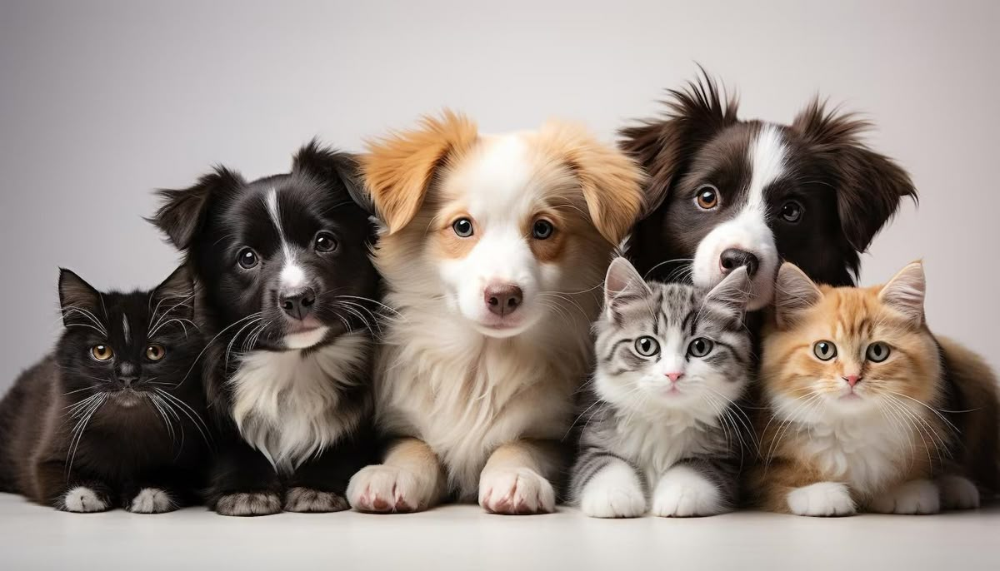

# Puppy Lovers 🐶

A responsive puppy lovers webpage built with HTML, CSS, and Bootstrap 5.

## 🛠️ Technologies Used
- HTML5
- CSS3
- Bootstrap 5
- JavaScript

## 📌 Features
- Responsive layout using Bootstrap 5 grid system
- Puppy image gallery
- Google Fonts integration
- Mobile friendly design

## 📸 Preview


## 🚀 How to Run
1. Clone the repo
```bash
   git clone https://github.com/Beshenana/puppy-lovers.git
```
2. Open `PUPPY.HTML` in your browser

## 👨‍💻 Author
**Beshenana** — [GitHub](https://github.com/Beshenana)